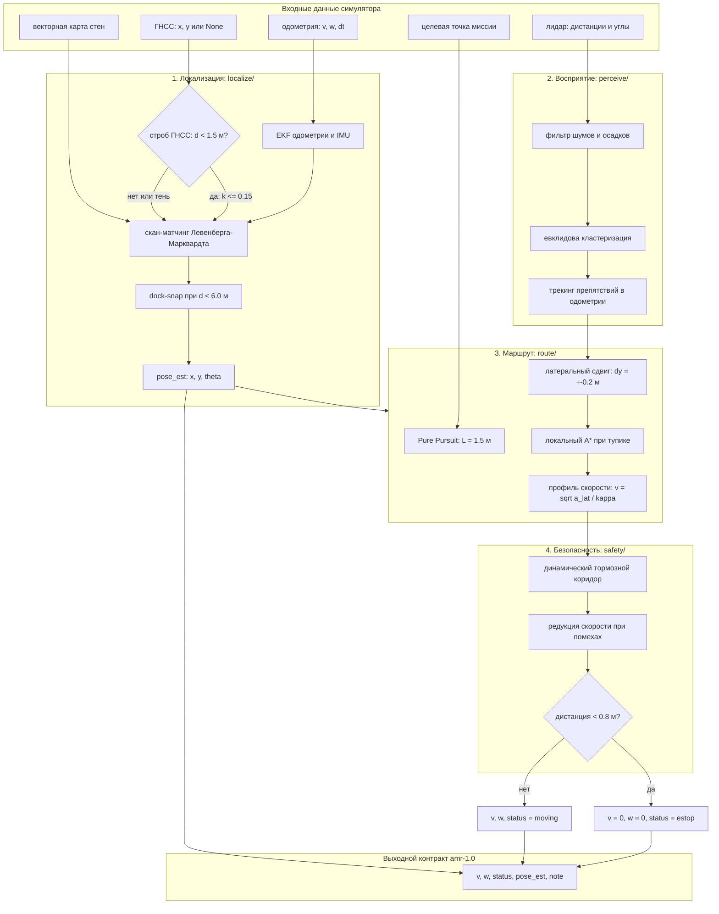

# Подход: контроллер безопасного маршрута Dreamteam 4.0

## Архитектура конвейера данных:

## Контракты обмена данными:
- входной срез: одометрия платформы, массив лучей лидара, координаты ГНСС при наличии сигнала, векторный граф стен и целевая точка;
- выходной кортеж: линейная скорость `v`, угловая скорость `w`, статус платформы `status`, расчетная поза `pose_est`, диагностическая строка `note`.

## Локализация (team_dreamteam_4_0/localize/):
- расширенный фильтр Калмана EKF по одометрии, IMU и скан-матчинг Левенберга-Марквардта со стенами;
- строб ГНСС 1.5 м при k <= 0.15, dock-snap при дистанции до цели не более 6.0 м и невязке стен менее 0.6 м;
- при потере позы поиск Coarse-to-Fine в окне +-5 м, шаг сетки 0.5 м.

## Маршрут и следование (team_dreamteam_4_0/route/):
- чистое преследование Pure Pursuit с lookahead 1.5 м и профилем скорости v = sqrt(a_lat / kappa) при a_lat <= 0.85 м/с²;
- латеральный сдвиг коридором шагом 0.2 м до зазора 1.1 м и локальный A* по сетке 0.5 м при блокировке пути.

## Безопасность и восприятие (team_dreamteam_4_0/safety/):
- трекинг препятствий в одометрическом базисе и пороговые зоны: v <= 0.22 м/с при 3.3 м, останов при зазоре менее 0.8 м;
- безопасная скорость: в тумане 0.9 м/с на пустом коридоре и 0.35 м/с при наличии кластера впереди;
- коридор торможения лидаром, аварийный estop 2.5 м/с², статус moving по одометрии и статус lost только после остановки.

## Чего нет и почему:
- нет тяжелого MPC и MCL: расчет в чистом Python на 10^4 шагов не укладывается в бюджет времени;
- нет копирования сырого ГНСС: медиана ошибки ГНСС 0.46 м несовместима с допуском дока 0.2 м, ГНСС подмешивается исключительно через k <= 0.15 без прямого копирования в позу;
- нет фильтра IMM: одиночный фильтр Калмана с порогом неподвижности надежнее и не вносит фазовой задержки.

## Ограничения конвейера:
- плоская геометрия: расчет кинематики выполняется в 2D без учета рельефа и уклонов;
- априорная карта: скан-матчинг требует статических стен или ориентиров; на открытых пустых площадках точность снижается до дрейфа одометрии;
- вычислительный бюджет: жесткое ограничение времени 10 мс на шаг исключает глобальный перерасчет графа на каждом такте.

## Транзакционность и надежность состояний:
- конечный автомат переходов: платформа исключает переход в аварийный статус lost во время движения; фиксация lost возможна строго после полной остановки;
- детерминированность такта: шаг управления представляет собой чистую функцию от текущего сенсорного среза и внутреннего вектора состояния без сторонних эффектов;
- атомарность команд: управляющий кортеж передается в исполнительный контур как единая неделимая структура данных.

## Масштабируемость:
- децентрализация парка: контроллер автономен на борту и не требует постоянного радиоканала для контура безопасности;
- пространственная индексация: локализация фильтрует стены карты в радиусе видимости сенсора с вычислительной сложностью от локального числа объектов, а не от всей площади предприятия;
- запас производительности: среднее время шага 1.3 мс оставляет более 85 процентов вычислительного ресурса платформы при частоте 100 Гц.

## Промышленная эксплуатация:
- переносимость ядра: алгоритмы используют базовые матричные операции NumPy и транслируются в C++ или Rust без архитектурных изменений;
- деградация сенсоров: при подавлении ГНСС платформа сохраняет навигацию по лидару; при осадках снижает скорость вплоть до защитного останова;
- наблюдаемость: структурированная телеметрия в поле note обеспечивает сквозной мониторинг на диспетчерском пункте оператора.

